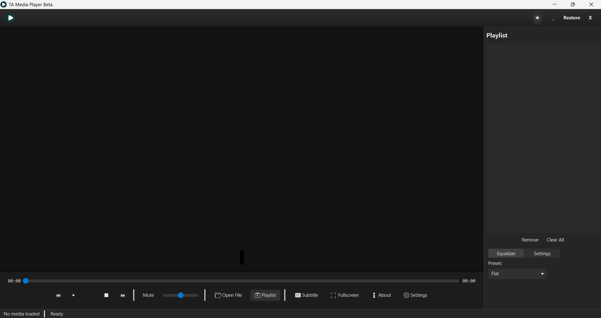
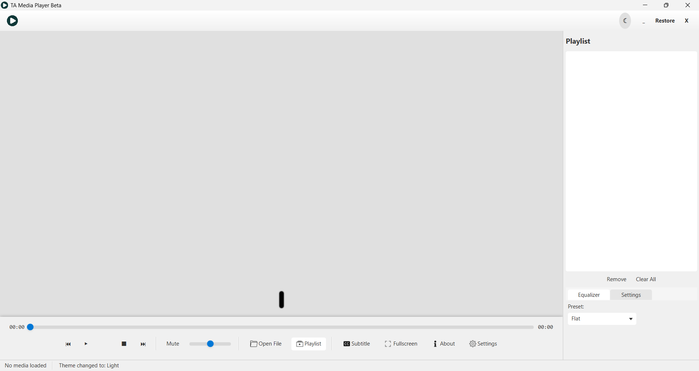

# 🎬 TA Media Player (Beta)
*The Ultimate Desktop Media Experience*

<div align="center">


**A sophisticated, feature-rich media player crafted for the modern user**

[🚀 Quick Start](#-quick-start) • [📖 Documentation](#-documentation) • [🎯 Features](#-features) • [💻 Installation](#-installation)

</div>

---

## 🌟 Overview

**TA Media Player** redefines your multimedia experience with cutting-edge technology and intuitive design. Built from the ground up with Java and JavaFX, it delivers professional-grade media playback with the simplicity users love. Whether you're a content creator, audiophile, or casual viewer, TA Media Player adapts to your workflow.

### ✨ What Makes It Special

> *"Bridging the gap between functionality and elegance in desktop media players"*

- **🎭 Adaptive Interface** — Seamlessly switches between dark and light themes
- **🎵 Universal Compatibility** — Handles all your favorite media formats
- **⚡ Performance-First** — Optimized for smooth playback and responsiveness
- **🎨 Customizable Experience** — Tailored to match your preferences

---

## 🎯 Core Features

### 🎥 **Media Playback Excellence**
- **Format Support**: MP4, MP3, WAV, AVI, MOV, FLAC, and more
- **HD/4K Ready**: Smooth playback of high-resolution content
- **Variable Speed**: Adjust playback from 0.25x to 2.0x speed
- **Frame-Perfect Seeking**: Precise navigation through your content

### 🎛️ **Advanced Controls**
- **Intuitive Timeline**: Drag to seek with visual feedback
- **Smart Volume**: Adaptive volume control with audio boost
- **Fullscreen Mode**: Immersive viewing experience
- **Picture-in-Picture**: Multitask while watching (coming soon)

### 📁 **Playlist Management**
- **Drag & Drop**: Effortlessly add media files
- **Smart Organization**: Auto-sort by name, date, or duration
- **Batch Operations**: Add entire folders at once
- **Persistent Playlists**: Your lists save automatically

### 🎚️ **Audio Enhancement**
- **10-Band Equalizer**: Fine-tune your audio experience
- **Preset Profiles**: Bass Boost, Rock, Jazz, Classical, Vocal, and more
- **Real-time Processing**: Instant audio adjustments
- **Custom Presets**: Save your personalized sound profiles

### 🎬 **Video Enhancement**
- **Subtitle Support**: Full SRT subtitle integration
- **Multi-language**: Switch between subtitle tracks
- **Subtitle Customization**: Adjust font, size, and position
- **Auto-sync**: Smart subtitle timing correction

### 🎨 **Theming & Customization**
- **Dual Themes**: Professional dark mode and clean light mode
- **Smooth Transitions**: Animated theme switching
- **Custom Styling**: Modify colors and layouts via CSS
- **Accessibility**: High contrast modes for better visibility

---

## 🛠️ Technology Stack

<div align="center">

| Component | Technology | Version |
|-----------|------------|---------|
| **Core Language** | Java | 17+ |
| **UI Framework** | JavaFX | 17+ |
| **Build System** | Maven | 3.8+ |
| **UI Layout** | FXML | Latest |
| **Styling** | CSS3 | Custom |
| **Packaging** | Launch4j | 3.14+ |

</div>

### 🏗️ Architecture Highlights

- **MVC Pattern**: Clean separation of concerns
- **Modular Design**: Easy to extend and maintain
- **Event-Driven**: Responsive user interactions
- **Resource Efficient**: Optimized memory usage

---

## 🚀 Quick Start

### Prerequisites Checklist
- [ ] Java Development Kit (JDK) 17 or higher
- [ ] JavaFX 17+ (bundled with OpenJFX)
- [ ] Maven 3.8+ for building
- [ ] Windows 10/11 (primary support)

### ⚡ Installation Methods

#### Method 1: Pre-built Release (Recommended)
```bash
# Download the latest release
curl -L https://github.com/yourusername/TA-Player/releases/latest/download/TA-MediaPlayer.exe

# Or visit the releases page for manual download
```

#### Method 2: Build from Source
```bash
# Clone the repository
git clone https://github.com/yourusername/TA-Player.git
cd TA-Player

# Build with Maven
mvn clean compile javafx:run

# Or create a distributable package
mvn clean package
```

#### Method 3: Developer Setup
```bash
# For development with hot reload
mvn javafx:run -Djavafx.args="--enable-preview"
```

---

## 🎮 Usage Guide

### Basic Operations
| Action | Shortcut | Description |
|--------|----------|-------------|
| **Play/Pause** | `Space` | Toggle playback |
| **Fullscreen** | `F` | Enter/exit fullscreen |
| **Mute** | `M` | Toggle audio mute |
| **Volume Up** | `↑` | Increase volume by 10% |
| **Volume Down** | `↓` | Decrease volume by 10% |
| **Seek Forward** | `→` | Jump 10 seconds ahead |
| **Seek Backward** | `←` | Jump 10 seconds back |

### Advanced Features
- **Playlist Creation**: Drag files directly into the application window
- **Theme Switching**: Click the theme toggle in the top-right corner
- **Equalizer Access**: Right-click on the volume control
- **Subtitle Loading**: Drag .srt files alongside your video files

---

## 📸 Visual Showcase

<div align="center">

### 🌙 Dark Theme Experience
> *Cinematic viewing with reduced eye strain*



### ☀️ Light Theme Experience  
> *Clean, professional interface for all environments*



</div>

---

## 🔧 Configuration

### Custom Themes
Create your own themes by modifying the CSS files in `src/main/resources/css/`:
```css
/* Example custom theme snippet */
.root {
    -fx-base: #your-color;
    -fx-background: #your-background;
}
```

### Equalizer Presets
Add custom audio presets in `config/equalizer-presets.json`:
```json
{
  "Custom": {
    "31Hz": 2.0,
    "62Hz": 1.5,
    "125Hz": 1.0
  }
}
```

---


## 🤝 Contributing

We welcome contributions from the community! Here's how you can help:

### 🐛 Bug Reports
Found a bug? Please create an issue with:
- Detailed description
- Steps to reproduce
- System information
- Expected vs actual behavior

### 💡 Feature Requests
Have an idea? We'd love to hear it:
- Use case description
- Mockups or sketches (if applicable)
- Technical considerations

### 🔧 Code Contributions
Ready to code? Follow our guidelines:
1. Fork the repository
2. Create a feature branch
3. Make your changes
4. Add tests if applicable
5. Submit a pull request

---

## 📄 License & Legal


```
Copyright (c) 2025 Tharusha Adithya
```


---

## 🙏 Acknowledgments

### Special Thanks
- **JavaFX Community** — For the powerful UI framework
- **Maven Contributors** — For seamless build automation
- **Cursor AI** — For enhanced development productivity
- **Our Beta Testers** — For invaluable feedback and bug reports

### Third-Party Libraries
- **ControlsFX** — Enhanced UI components
- **Jackson** — JSON processing
- **SLF4J** — Logging framework

---

## 📞 Support & Community

<div align="center">

[](https://github.com/yourusername/TA-Player/issues)
[](https://github.com/yourusername/TA-Player/discussions)
[](https://discord.gg/your-discord)

**Questions?** [Start a Discussion](https://github.com/yourusername/TA-Player/discussions) • **Found a Bug?** [Report an Issue](https://github.com/yourusername/TA-Player/issues)

</div>

---

<div align="center">

**Made with ❤️ by the TA Media Player Team**

*Crafting exceptional media experiences, one release at a time*

[⬆️ Back to Top](#-ta-media-player-beta)

</div>
